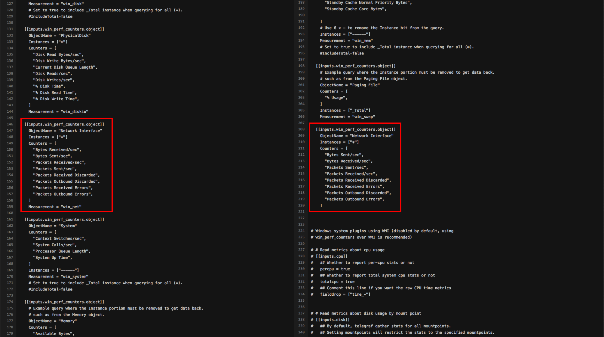
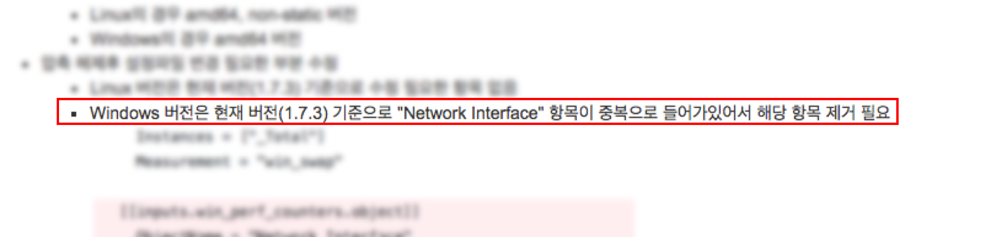
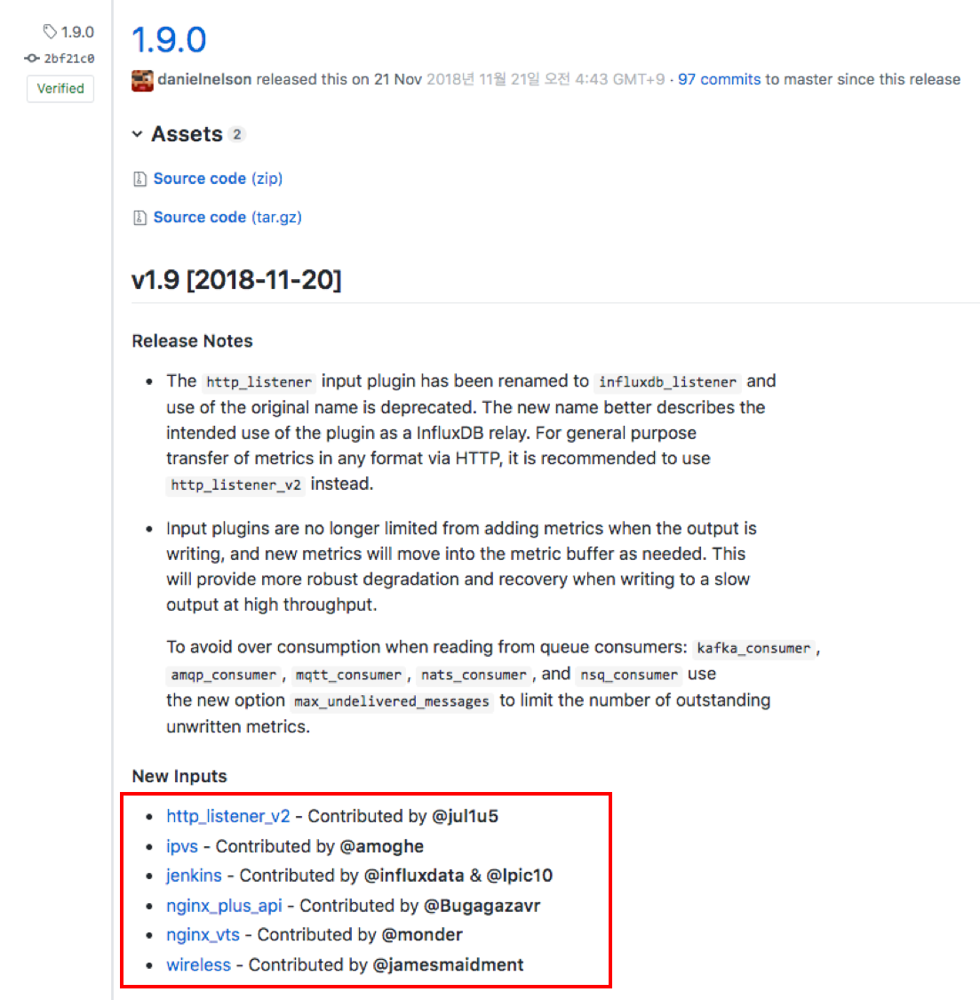
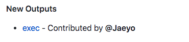

그동안 개발자로 일하면서 오픈소스의 도움을 많이 받아왔던 것 같다. 아닌게 아니라 당장 Github이 없으면 나는 현재의 생산성의 반의 반도 못 내고 있을 것이다. 하지만 부끄럽게도 작년에야 처음으로 오픈소스에 기여를 하게 되었다. 사실 기여를 하고자 하는 생각은 아주 오래전부터 가지고 있었다. 하지만 기여할 프로젝트를 고르는 문제부터 시작해서, 기존 소스코드를 파악하고, 버그의 원인을 찾고, 메인테이너와 소통하고 하는 일들이 너무 어렵게 느껴져 시도하지 못했다고 하는게 맞을 것 같다. 그러던 차에 우연찮게 처음으로 오픈소스 프로젝트에 기여하게 되었고 그 과정이 생각보다 어렵지 않다는 것을 알게 되었다.

내가 참여한 오픈소스는 [Telegraf](https://github.com/influxdata/telegraf) 였다. 뭐 이름이 생경하게 들릴 수는 있지만 그래도 나름 모니터링 쪽 동네에서는 방귀좀 뀌는 프로젝트다. 일반적으로 모니터링이라고 하면 서버 모니터링 (IaaS 레벨의 모니터링)과 애플리케이션 모니터링(APM) 정도를 많이 떠올릴 텐데, 이 Telegraf 는 서버 모니터링 쪽에서 활약하고 있는 메트릭 수집 에이전트다.

모니터링은 일반적으로 `수집` -> `저장` -> `분석` -> `시각화` 정도의 플로우를 타게 된다. (중간에 순서가 조금 바뀌는 경우는 있다.) 여기서 Telegraf 는 `수집`단을 맡고 있다. Elastic stack 의 `metricbeat`와 포지셔닝이 비슷하다고 할 수 있을 것이다.

말 나온 김에 모니터링 영역에서 Elastic 스택과 TICK 스택을 비교해보자면, `Beat` -> `Logstash` -> `Elastiverseticsearch` -> `Kibana` 의 플로우를 가지고 있는 Elastic 스택은 기본적으로 로그 모니터링에 근간을 두고 있다. 애초에 Elasticsearch 라는 솔루션이 풀 텍스트 인덱싱을 하는 Lucene 으로 만들어진 물건이니. 물론 요즘에는 로그와 메트릭 뿐만 아니라 APM 까지 만들어서 애플리케이션 레벨의 모니터링까지 영역을 넓히고 있긴 하다.

그에 반해, TICK 스택은 메트릭 기반의 모니터링이라고 볼 수 있다. 여기서 메트릭과 로그의 차이점이라고 하면, 로그는 단순히 문자열 형태의 메시지라면 메트릭은 수치값을 가지는 형태라고 볼 수 있을 것이다. 애초에 Telegraf 자체도 메트릭 수집에 특화되어 있고 데이터 저장소인 InfluxDB 도 시계열 데이터를 저장하는 데이터베이스로 만들어져 있다.

여기서 TICK 스택이라고 하면 `Telegraf`, `InfluxDB`, `Chronograf`, `Kapacitor` 로 이루어진 스택을 이야기하는데 그런 것 치고 시각화 영역을 Chronograf 로 쓰는 경우는 별로 없다. 사실 `Chronograf` 보다는 `Grafana` 가 시각화 도구로서 기능도 더 많고 기타 여러 데이터 소스와의 접합도 좋아서 `TIG` (`Telegraf` - `InfluxDB` - `Grafana`) 형태의 스택이 더 많이 쓰이는 것 같다. 근데 문제는 `Grafana` 쪽에서는 TICK 스택보다는 `Prometheus` 랑 더 친하고 요즘 container 기반 에코 시스템에서 Prometheus 가 더 잘 나간다는 사실이다. 그리고 둘 다 Go 언어로 만들어져 있다. 사실 요즘 container 기반의 에코 시스템 위의 툴들은 열에 여덟은 Go 언어를 사용하고 있는 것 같다. 이쪽 동네의 de facto 언어가 되어가는 느낌이다.

아무튼 각설하고, Telegraf 앞서 말했든 메트릭 수집 에이전트다. 하지만 Telegraf 를 설명하는 말에는 항상 수식어가 하나 더 붙는다. "플러그인 기반" 이 그것이다. Telegraf 는 다양한 플러그인을 통해서 다양한 종류의 메트릭들을 수집할 수 있다. 그리고 수집된 메트릭을 꼭 InfluxDB 에만 넣을 수 있는 것도 아니라 다른 Output Plugin 을 통해서 다른 종류의 데이터 저장소에 집어 넣는 것도 가능하다.

위의 그림은 Telegraf 공식 웹페이지에 있는 그림으로 TICK 스택의 아키텍처를 자세하게 보여준다. 여담으로 작년말에 확인해 봤을 때는 저 그림에 "200개 이상의 플러그인 지원" 관련된 문구가 써있었는데 실제로 확인해봤을 땐 198개 였다. 뭐 그냥 그려려니 했다. 아무튼 Telegraf 에서 지원하는 플러그인 리스트는 Telegraf Github 에 들어가면 README 에서 바로 확인할 수 있는데 오늘 날짜 master 브랜치 기준으로 아래와 같다.

- Input Plugins: activemq, aerospike, amqp_consumer, apache, aurora, aws cloudwatch, bcache, beanstalkd, bind, bond, burrow, cassandra, ceph, cgroup, chrony, cisco_telemetry_gnmi, cisco_telemetry_mdt, cloud_pubsub, cloud_pubsub_push, conntrack, consul, couchbase, couchdb, cpu, DC/OS, diskio, disk, disque, dmcache, dns query time, docker, docker_log, dovecot, ecs, elasticsearch, exec, fail2ban, fibaro, file, filestat, filecount, fireboard, fluentd, github, graylog, haproxy, hddtemp, httpjson, http_listener, http_listener_v2, http, http_response, icinga2, influxdb, influxdb_listener, internal, interrupts, ipmi_sensor, ipset, iptables, ipvs, jenkins, jolokia2, jolokia, jti_openconfig_telemetry, kafka_consumer, kapacitor, kinesis, kernel, kernel_vmstat, kibana, kubernetes, kube_inventory, leofs, linux_sysctl_fs, logparser, lustre2, mailchimp, mcrouter, memcached, mem, mesos, minecraft, mongodb, mqtt_consumer, multifile, mysql, nats_consumer, nats, neptune_apex, net, net_response, netstat, nginx, nginx_plus_api, nginx_plus, nginx_upstream_check, nginx_vts, nsq_consumer, nsq, nstat, ntpq, nvidia_smi, openldap, opensmtpd, openweathermap, pf, pgbouncer, phpfpm, phusion passenger, ping, postfix, postgresql_extensible, postgresql, powerdns, powerdns_recursor, processes, procstat, prometheus, puppetagent, rabbitmq, raindrops, redis, rethinkdb, riak, salesforce, sensors, smart, snmp_legacy, snmp, socket_listener, solr, sql server, stackdriver, statsd, swap, syslog, sysstat, system, tail, temp, tcp_listener, teamspeak, tengine, tomcat, twemproxy, udp_listener, unbound, uswgi, varnish, vsphere VMware vSphere, webhooks, filestack, github, mandrill, papertrail, particle, rollbar, win_perf_counters, win_services, wireless, x509_cert, zfs, zipkin, zookeeper
- Parsers: InfluxDB Line Protocol, Collectd, CSV, Dropwizard, FormUrlencoded, Graphite, Grok, JSON, Logfmt, Nagios, Value, Wavefront
- Serializers: InfluxDB Line Protocol, JSON, Graphite, ServiceNow, SplunkMetric, Carbon2, Wavefront
- Processor Plugins: converter, date, enum, override, parser, pivot, printer, regex, rename, strings, topk, unpivot
- Aggregator Plugins: basicstats, final, histogram, minmax, valuecounter
- Output Plugins: influxdb, influxdb_v2, amon, amqp (rabbitmq), application_insights, aws kinesis, aws cloudwatch, azure_monitor, cloud_pubsub, cratedb, datadog, discard, elasticsearch, file, graphite, graylog, health, http, instrumental, kafka, librato, mqtt, nats, nsq, opentsdb, prometheus, riemann, riemann_legacy, socket_writer, stackdriver, syslog, tcp, udp, wavefront

---

Telegraf 에 대한 자세한 설명은 생략하기로 하고, 회사에서 업무의 일환으로 Telegraf 를 사용중에 있다. 이전까지는 운영중인 Linux 기반의 서버들에서 메트릭을 수집하기 위한 용도였는데 윈도우 서버도 추가적으로 지원해야 하는 요구사항이 발생되었다. Telegraf 는 윈도우 역시 지원하기 때문에 별 고민없이 설치하고 테스트를 하기 시작했다. 다만 리눅스와 윈도우는 메트릭을 수집하는 방법에 차이가 있어 리눅스 서버와는 다른 윈도우용 기본 설정 파일을 받아서 구성했다.

헌데 설정파일을 받아놓고 슥 한번 훑어보는데 이상한 부분이 눈에 띄었다.

Network 관련된 메트릭을 수집하는 설정을 설정 파일 위쪽에서 한 번 본 것 같은데 아래에서 또 발견되었다. 보통 이런 경우는 "Telegraf 의 기본 설정 파일이 잘못 되었구나" 라고 여기기 보다는 "내가 뭘 잘못 했구나" 라고 생각하기 쉽다. 자연히 나도 붙여넣기하면서 실수 했겠거니 하면서 새롭게 윈도우용 설정 파일을 다시 받았다. 하지만 새로 받은 설정 파일에도 해당 섹션은 중복되어 있었다.

그제서야 기본 설정 파일이 잘못되어 있는 걸 확인하고는 Telegraf 에 대한 사내 가이드 문서에 위와 같은 내용을 추가하였다. 그러고나서 문득 생각해보니, 이건 PR을 꽁으로 한 번 할 수 있는 기회가 아닌가 하는 생각이 들었다. 나는 곧바로 중복된 설정을 제거하는 내용의 PR을 만들어 올렸고, 명백한 설정 오류였기 때문에 별 문제없이 바로 merge가 되었다. 메인테이너로부터 "Thanks!" 라는 코멘트를 받았다.

사실 이 코멘트를 보고 기분이 좀 이상했다. 지금껏 밤낮 가리지 않고 열심히 코딩에 매진해오긴 했지만 내가 쓴 코드(사실은 간단한 설정 파일 수정이지만)로 인해 누군가에게 고맙다는 말을 들어본 적이 없었다. 물론 내가 쓴 코드로 회사가 돈을 벌긴 하지만 그렇다고 해서 회사가 내게 고맙다는 말을 해주진 않는다. 대신 월급을 준다. (이 경우엔 당연히 월급이 더 좋다.)

개인적으로 칭찬에 약한 타입이라 뭔가 Telegraf 프로젝트에 더 기여하고 싶다는 생각이 들었다.

사실 위에서도 이야기했듯이 이전에도 오픈소스에 대한 기여를 시도해본 적이 몇 번 있었다. 하지만 그 때는 확실히 접근법이 좋지 않았던 것 같다.

1. 오픈소스에 기여를 해보고 싶은데...
2. 기왕 하는거 좀 크고 유명한 데에 해보고 싶은데...
3. 크고 유명한 오픈소스 프로젝트를 클론 받는다.
4. main 문을 찾아 시작점부터 따라가본다.... 3분 후 포기한다.
5. 공식 문서를 찾아 정독해본다.... 30분 후 포기한다.
6. 해당 프로젝트의 아주 초기 버전을 체크아웃해 다시 소스를 따라가본다.... 5분 후 포기한다.
7. 포기한다.

위의 방법은 사실 지금보기에는 오픈소스 기여에 대한 아주 좋지 않은 접근법이라고 생각된다. 사실 기여를 할 오픈소스를 고를 때는 본인이 사용중인 것들 중에서 고르는 것이 제일 유리하다고 생각한다. 나한테는 Telegraf 가 그런 것 중 하나였고, 그 외에도 여러가지로 덤벼볼만한 요소들이 좀 있었다.

1. 실제 사용중인 프로그램
2. 익숙하게 사용하던 Go 언어로 구현됨
3. 플러그인 기반이라 코드 파악과 수정이 쉬움
4. 플로그인 별로 README 문서가 있어 파악에 용이

이 중에서도 특히 3번이 굉장히 유효했다. 말 그대로 플러그인 기반이기 때문에 Telegraf 의 코어 부분을 손대지 않는 한 다른 코드는 볼 필요없이 내가 고치고 싶은 플러그인의 코드만 보면 됐고 대부분의 경우 플러그인은 하나 내지 두 개의 파일 안에 전부 담겨있다. 게다가 플러그인이 어떤 인터페이스를 가져야 하는지에 대한 부분도 문서에 상세히 설명되어 있으니 코드를 따라가기도 더 쉬웠다.

게다가 더 좋았던 건, Go 언어를 사용하면서 테스트를 어떻게 작성해야 할 지 고민할 때가 많은데, Telegraf 의 경우에는 테스트 파일들도 잘 구성되어 있어 테스트를 작성하는 요령을 익히기가 좋다는 것이다. (사실 테스트가 없으면 merge 가 안된다.)

그리고 추가적으로, 새로운 플러그인을 만든 사람의 경우에는 아래와 같이 Release Note에 이름을 박아준다.

아직 bugfix 성 밖에 기여를 못해서 여기에 이름을 올리지는 못했지만 조만간 올렸으면 한다.

---

> 2019-09-04 추가,
>
> 
>
> 됐다.